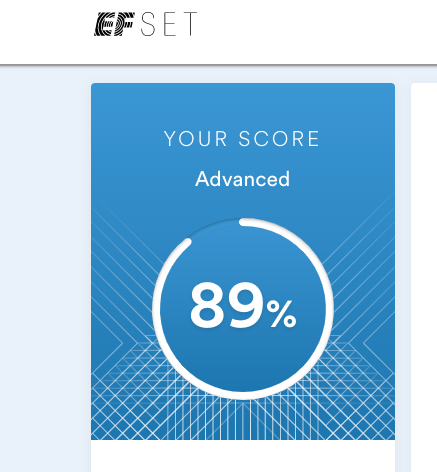

# Maniiasova Nazgul

## Currently self-studying Frontend Development and Python Django

### Contact information

**Phone:** +32 496 202550
**Email:** maniyasova.n@gmail.com
[LinkedIn](https://www.linkedin.com/in/nazgul-maniiasova/?locale=en_US)
[GitHub](https://github.com/NazgulM)

### About myself

Since I moved to Brussels, Belgium in 2019, my life was changed. My 14 years previous experience in big telecommunications company ZTE Corporation in Kyrgyzstan as HR manager, freelance income accountant and translator of Chinese-Russian languages hasn't demand in Belgium.

So I have started to learn Dutch and French. In case of requirements of modern world, I have decided to study from February 2022 Frontend Development and Python Django.

I have higher diploma in International Relations and Oriental Studies and Master degree in Economics (Finance and Credit) and a lot of completion certificates in HR Management.

I hope and believe, that my passion to study and develop myself, ability to learn give me a chance to become professional Developer.

### Skills

- HTML5, CSS3
- Javascript Basic
- Python, MySQL
- GitHub
- VSCode, IntelliJ Idea, PyCharm, MySQL Workbench
- Bootstrap, Django

### Code Example

```javascript
function generateComputerChoice() {
  const randomNumber = Math.floor(Math.random() * 3) + 1;

  if (randomNumber === 1) {
    computerChoice = "rock";
  }
  if (randomNumber === 2) {
    computerChoice = "scissors";
  }
  if (randomNumber === 3) {
    computerChoice = "paper";
  }
  computerChoiceDisplay.innerHTML = computerChoice;
}
```

---

### Courses

- Responsive Web Design on [FreeCodeCamp](https://www.freecodecamp.org/learn)

- Learn Java Course on [Codecademy](https://www.codecademy.com/)

- HTML Course on [Sololearn](https://www.sololearn.com/learning)

- Learn CSS on [Sololearn](https://www.sololearn.com/learning)
- Frontend Development (in progress) [RsSchool](https://app.rs.school/course/schedule?course=js-fe-preschool-2022q2)
- Python Django (in progress) [BeCoder online courses](https://becoder24.online/)

---

### Languages

- Kyrgyz \- Native

- Russian \- Native

- Chinese \- (C1)
- English \- Advanced according online test [EFSET](https://www.efset.org/)
   
  In my opinion my English level now is Upper Intermediate.
- Dutch - Upper Intermediate (B1)
- French - Beginner (A2)
